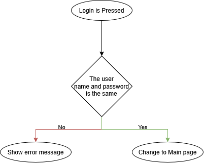
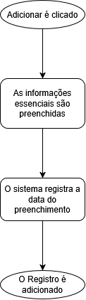

# CRUD - Controle de Estoque

# Projeto

A Inventory, Stock and Purchase management system based on Java Spring-Boot Back-End and a React Front-End is designed to streamline and optimize the entire lifecycle of an organization assets, from acquirement to use.

# Requisitos de Qualidade

| ID | Requisition |
| --- | --- |
| RNF - 1 | A Aplicação deve ser feita em Java, Maven, Mongo, e React. |
| RNF - 2 | O Back-End deve ser alocado em um contêiner. |
| RNF - 3 | A interface exige intuitividade. |
| RNF - 4 | O site deverá atender às normas legais da autarquia |

# Requisitos Funcionais

| ID | Nome | Descrição | Prioridade |
| --- | --- | --- | --- |
| RF - 1 | Login | O Usuário deve ser capaz de efetuar login para fazer as operações de CRUD da maneira apropriada | Média |
| RF - 2 | Cadastrar Compra | O usuário deve poder cadastrar uma nova compra contendo nome, valor e quantidade em unidade | Alta |
| RF - 3 | Editar Compra | O usuário deve poder alterar os dados da compra caso preenchidos de maneira errônea | Alta |
| RF - 4 | Deletar Compra | A compra deve poder ser removida por administradores caso necessário | Alta |
| RF - 5 | Relatório Quinzenal | De 15 em 15 dias o Sistema deve efetuar um relatório que será enviado via e-mail e também será mostrado para os administradores | Média |

# Diagrams

## RF - 1: Log-In

## RF - 2: Add Purchase

